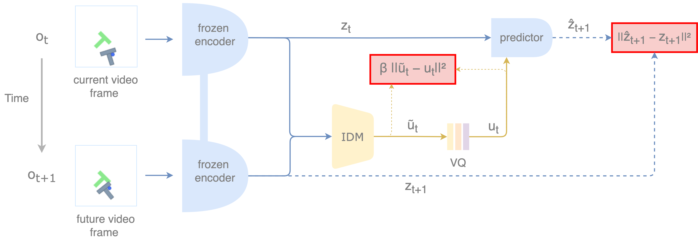

# Action-Label-Free World-Model Planning: Extending DINO-WM with Inverse Dynamics



World models enable agents to predict the consequences of their actions and plan in imagined
futures. Recent work combines large-scale self-supervised visual encoders with action-conditioned
predictors, demonstrating strong generalization and even zero-shot planning. However, most
approaches still rely on labeled action data, which is scarce and embodiment-specific, limiting
scalability and transfer. Although latent action models aim to learn control representations
directly from observations, they often depend on pixel-level reconstruction and use reactive
policies instead of test-time optimization. In this work, we study whether model-based planning
performance remains comparable when action labels are replaced by discrete latent actions. We
present a world model trained from offline image-only trajectories that infers discrete latent
actions via inverse dynamics in DINOv2 embedding space and jointly learns a forward dynamics
predictor. Goal-conditioned planning is performed through trajectory optimization over the
learned latent action space using discrete CEM. On PushT, we show that a continuous latent-action
formulation achieves low latent prediction error but collapses during planning (SR 0.02).
Introducing vector quantization prevents shortcut leakage and enables non-trivial planning (SR
0.19), yet remains below the action-supervised baseline (SR 0.52). These results indicate that
low latent prediction error alone does not guarantee controllable dynamics, and that action-label-
free planning requires a constrained latent-action bottleneck together with improved alignment
between learned action codes, long-horizon rollouts, and downstream decoding.

**Author:** Julian Quast (Technische Universität Berlin)

---

### Contents

1. [Use of Third-Party Code and AI Tools](#use-of-third-party-code-and-ai-tools)  
2. [Datasets and Checkpoints](#datasets-and-checkpoints)
3.  [Installation](#installation) 
4. [Train an Inverse Dynamics (IDM) Variant](#train-an-inverse-dynamics-idm-variant)  
5. [Train the Decoder](#train-the-decoder)  
6. [Planning with the Variants](#planning-with-the-variants)  
7. [Compute Metrics](#compute-metrics)  
8. [Project Structure](#project-structure)  
9. [Citation](#citation)  

---

### Use of Third-Party Code and AI Tools

This repository is based on a fork of the official **DINO-WM** implementation  
([Zhou et al., 2024](https://arxiv.org/abs/2503.18938).

Parts of the latent action model implementation are adapted from **AdaWorld**  
([Gao et al., 2025](https://arxiv.org/abs/)).

Additional code changes and implementations were developed with the assistance of AI tools, including ChatGPT 5.2 and Codex (OpenAI). The author retains full responsibility for the final code.

---

### Datasets and Checkpoints

All model variants are trained for 162k steps. The evaluated variants include an action-label-conditioned baseline (Baseline), a latent action variant without vector quantization (LA), and a variant with discrete latent actions (LA-VQ). Each Checkpoint provides the weights (model_latest.pth) and config (hydra.yaml).

**The datasets:** 

- [push_t_noise_10k](https://drive.google.com/file/d/1nzduCAhoVf0r3HxJsquAZTo0UrKtHZvw/view?usp=sharing)
- [push_t_noise_1k](https://drive.google.com/file/d/1oX-TVr1SdhE0C2tCGdbKneM_Lk_-Oy1G/view?usp=sharing)

**The checkpoints:**
- [Baseline](https://drive.google.com/drive/folders/1MEhkRvmH_d3nhIr40V3wTNetTHx2qdRO?usp=sharing)
- [LA](https://drive.google.com/drive/folders/1LxFJRY-SjWs4XQmuNjeyhGT5t3mwLoy3?usp=sharing)
- [LA-VQ](https://drive.google.com/drive/folders/1UNR85PqaGgj7sDhSpAgy43iPBjs8gJqv?usp=sharing)


---

### Installation

Create the environment directly from the provided YAML file:

```bash
micromamba create -y -n dino-wm-latent-actions -f dino_wm_latent_actions/environment.yaml
```
---

### Train a Variant by yourself

If you want to train with a different config change the train.yaml file.

```bash
os.environ['DATASET_DIR'] = '<path/to/dataset>'
```

**The Baseline:**

```bash
micromamba run -n dino-wm-latent-actions \
  python dino_wm_latent_actions/train.py \
    --config-name train.yaml \
    env=pusht \
    model.use_action_encoder=true \
    model.use_lam=false \
    model.use_vq=false \
    model.train_action_encoder=true \
    model.train_lam=false
```

**LA-VQ:**

```bash
micromamba run -n dino-wm-latent-actions \
  python dino_wm_latent_actions/train.py \
    --config-name train.yaml \
    env=pusht \
    model.use_action_encoder=false \
    model.use_lam=true \
    model.use_vq=true \
    model.train_action_encoder=false \
    model.train_lam=true
```

**LA:**

```bash
micromamba run -n dino-wm-latent-actions \
  python dino_wm_latent_actions/train.py \
    --config-name train.yaml \
    env=pusht \
    model.use_action_encoder=false \
    model.use_lam=true \
    model.use_vq=false \
    model.train_action_encoder=false \
    model.train_lam=true
```
---

### Train the Action Decoder

This runs the decoder with a batch size of 256, on a train/val split of 100k/10k with erly stopping patience 5 in the latent state + latent action config.

```bash
os.environ['DATASET_DIR'] = '<path/to/dataset>'
```

**LA:**
RUN_DIR="path/to/LA model checkpoint"

micromamba run -n dino-wm-latent-actions \
  python dino_wm_latent_actions/train_action_decoder.py \
    --run_dir "$RUN_DIR" \
    --ckpt "checkpoints/model_latest.pth" \
    --rebuild_cache \
    --latent_source continuous \
    --seed 0 \
    --use_e \
    --use_z

**LA-VQ:**
RUN_DIR="path/to/LA-VQ model checkpoint"

micromamba run -n dino-wm-latent-actions \
  python dino_wm_latent_actions/train_action_decoder.py \
    --run_dir "$RUN_DIR" \
    --ckpt "checkpoints/model_latest.pth" \
    --rebuild_cache \
    --latent_source vq \
    --seed 0 \
    --use_e \
    --use_z


if you want to run the decoder training with different args checkout the train_action_decoder.py main()

---

### Planning with the Variants

If you want to train with a different config change the plan_pusht.yaml file.

```bash
os.environ['DATASET_DIR'] = '<path/to/dataset>'
```

**LA-VQ:**

```bash
micromamba run -n dino-wm-latent-actions \
  python dino_wm_latent_actions/plan.py \
    --config-name plan_pusht.yaml \
    ckpt_base_path="/path/to the checkpoint folder" \
    planner._target_="planning.discrete_cem.DiscreteCEMPlanner" \
    seed=0 \
    plan_action_type=discrete \
    use_action_encoder=false \
    use_lam=true \
    use_vq=true \
    use_e=true \
    use_z=true \
    use_delta=false \
    planner.topk=30 \
    planner.num_samples=300 \
    planner.opt_steps=10 \
    planner.pseudocount=1.0 \
    planner.momentum=0.7 \
    planner.min_prob=0.001 \
    planner.init_smoothing=0.05 \
    planner.sample_temperature=1.5 \
    name="discrete_cem"
```

**Baseline:**

```bash
micromamba run -n dino-wm-latent-actions \
  python dino_wm_latent_actions/plan.py \
    --config-name plan_pusht.yaml \
    ckpt_base_path="/path/to the checkpoint folder" \
    planner._target_="planning.cem.CEMPlanner" \
    seed=0 \
    plan_action_type=raw \
    use_action_encoder=true \
    use_lam=false \
    use_vq=false \
    use_e=true \
    use_z=true \
    use_delta=false \
    planner.topk=30 \
    planner.num_samples=300 \
    planner.opt_steps=10 \
    name="cem"
```

**LA:**

```bash
micromamba run -n dino-wm-latent-actions \
  python dino_wm_latent_actions/plan.py \
    --config-name plan_pusht.yaml \
    ckpt_base_path="/path/to the checkpoint folder" \
    planner._target_="planning.cem.CEMPlanner" \
    seed=0 \
    plan_action_type=latent \
    use_action_encoder=false \
    use_lam=true \
    use_vq=false \
    use_e=true \
    use_z=true \
    use_delta=false \
    planner.topk=30 \
    planner.num_samples=300 \
    planner.opt_steps=10 \
    name="cem"
```
---

### Compute Metrics

This runs the train.val() and aggregates mean and std over the val split. 

```bash
os.environ['DATASET_DIR'] = '<path/to/dataset>'
```

```bash
RUN_DIR="/path/to/model chekpoint forlder"

micromamba run -n dino-wm-latent-actions \
  python dino_wm_latent_actions/eval_val_metrics.py \
    --run_dir "$RUN_DIR" \
    --ckpt "checkpoints/model_latest.pth"
```

---

### Notes: The default num_rollouts for Rollout MSE is 600. If you dont need Rollouts during val reduce it. If you train the action decoder you can increase the train and val batch size (1024) to speed up cache sampling. 

### Citation

If you use this codebase in academic work, cite:

```bibtex
@misc{zhou2024dinowmworldmodelspretrained,
  title        = {DINO-WM: World Models on Pre-trained Visual Features enable Zero-shot Planning},
  author       = {Gaoyue Zhou and Hengkai Pan and Yann LeCun and Lerrel Pinto},
  year         = {2024},
  eprint       = {2411.04983},
  archivePrefix= {arXiv},
  primaryClass = {cs.RO},
  url          = {https://arxiv.org/abs/2411.04983}
}
````

```bibtex
@inproceedings{gao2025adaworld,
  title     = {AdaWorld: Learning Adaptable World Models with Latent Actions},
  author    = {Gao, Shenyuan and Zhou, Siyuan and Du, Yilun and Zhang, Jun and Gan, Chuang},
  booktitle = {International Conference on Machine Learning (ICML)},
  year      = {2025}
}
```

```bibtex
@misc{quast2026actionlabelfreewm,
  title        = {Action-Label-Free World-Model Planning: Extending DINO-WM with Inverse Dynamics},
  author       = {Quast, Julian},
  year         = {2026},
  note         = {Technische Universität Berlin}
}
```
